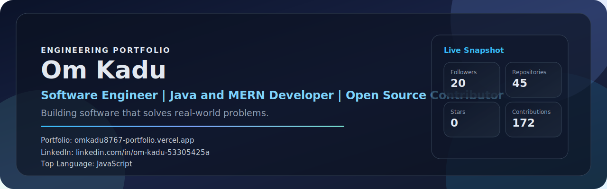
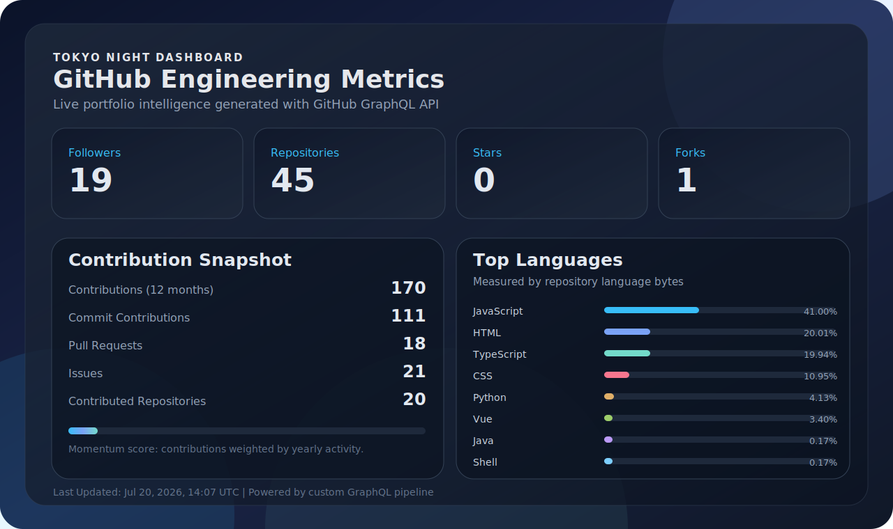
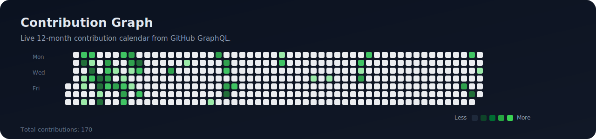

  

  

  
  
  
  

  
  
  
  
  

---

<h2 align="center">About</h2>

<table>
  <tr>
    <td width="50%" valign="top">
      <h3>Who I Am</h3>
      

        Fresher in Computer Science Engineering focused on building backend-heavy products with practical business value.
      

      <ul>
        <li>Java and Spring Boot learner with production mindset</li>
        <li>MERN developer with full-stack shipping experience</li>
        <li>Open source contributor who enjoys clean architecture</li>
      </ul>
    </td>
    <td width="50%" valign="top">
      <h3>Current Focus</h3>
      

        Building stronger depth in backend systems, scalable APIs, and cloud-native workflows.
      

      

        
        
      

      

        
        
        
      

    </td>
  </tr>
</table>

---

<h2 align="center">Tech Stack</h2>

  

<table>
  <tr>
    <td width="20%"><strong>Languages</strong></td>
    <td>Java, Python, JavaScript, C</td>
  </tr>
  <tr>
    <td><strong>Frontend</strong></td>
    <td>React, Tailwind CSS, HTML, CSS</td>
  </tr>
  <tr>
    <td><strong>Backend</strong></td>
    <td>Node.js, Express.js, Spring Boot</td>
  </tr>
  <tr>
    <td><strong>Database</strong></td>
    <td>MongoDB, MySQL, Firebase, SQLite</td>
  </tr>
  <tr>
    <td><strong>Cloud</strong></td>
    <td>Google Cloud, Docker, Linux</td>
  </tr>
  <tr>
    <td><strong>Others</strong></td>
    <td>Playwright, Solidity, IPFS</td>
  </tr>
</table>

---

<h2 align="center">Featured Projects</h2>

<table>
  <tr>
    <td width="50%" valign="top">
      <h3>Swastha Bharat Portal</h3>
      
<strong>Full Stack Healthcare Platform</strong>

      
JWT auth, appointment booking, medicine ordering, Dialogflow chatbot, Razorpay integration, secure REST APIs, responsive UX.

      

        
        
        
        
      

    </td>
    <td width="50%" valign="top">
      <h3>1688 to Shopify Product Importer</h3>
      
<strong>Automation platform for product scraping and Shopify import</strong>

      
Built an automation workflow to scrape, process, and move catalog data from 1688 into Shopify-ready format.

      

        
        
        
        
        
      

    </td>
  </tr>
  <tr>
    <td width="50%" valign="top">
      <h3>Warehouse Management System</h3>
      
<strong>Operational backend for inventory workflows</strong>

      
Designed robust APIs and relational data structures to manage inventory flow and warehouse operations.

      

        
        
        
      

    </td>
    <td width="50%" valign="top">
      <h3>InternHQ</h3>
      
<strong>Task Management System</strong>

      
Built role-aware task flow management with secure token-based authentication and team collaboration support.

      

        
        
        
        
        
      

    </td>
  </tr>
</table>

---

<h2 align="center">Certifications</h2>

  
  
  
  

---

<h2 align="center">Custom GitHub Dashboard</h2>

  

---

<h2 align="center">Contribution Graph</h2>

  

---

<h2 align="center">Snake Animation</h2>

  

---

<h2 align="center">Medium Articles</h2>

<!-- MEDIUM:START -->
- <a href="https://medium.com/@kaduom444/jwt-vs-paseto-the-epic-showdown-in-token-wars-440b4f711dc2?source=rss-082c957473dd------2"><strong>JWT vs PASETO: The Epic Showdown in Token Wars </strong></a> Read the latest write-up. Sep 02, 2025 • 1 min read
<!-- MEDIUM:END -->

---

<h2 align="center">Automation</h2>

<table>
  <tr>
    <td width="50%" valign="top">
      <strong>Dashboard Pipeline</strong>
      <ul>
        <li>GitHub GraphQL API for stars, followers, repos, forks, commits, PRs, and languages</li>
        <li>Medium RSS ingestion for latest articles</li>
        <li>SVG rendering engine for visual dashboard components</li>
      </ul>
    </td>
    <td width="50%" valign="top">
      <strong>Update Frequency</strong>
      <ul>
        <li>GitHub Actions scheduled every 12 hours</li>
        <li>Manual trigger support via workflow_dispatch</li>
        <li>Commits generated assets and data automatically</li>
      </ul>
    </td>
  </tr>
</table>

  

